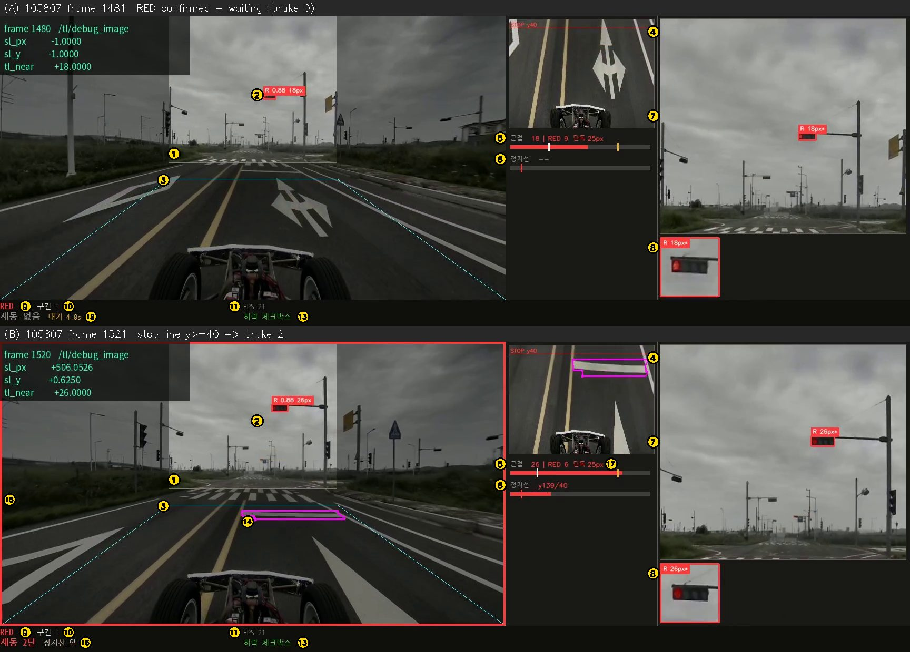

# 신호등 인지·판단 — 질문과 답 (white2 `traffic_light.py`)

> 2026-10-08 세션에서 나온 질문에 **현재 코드 기준**으로 답을 모았다. 코드: `white2/white2/traffic_light.py`
> (white1 판은 머리말·import 만 다르다 — `diff <(sed s/white2/white1/g …) …` = 13줄). 값을 바꾸는 법은 [TL_TUNING.md](TL_TUNING.md).
> 코드와 이 문서가 어긋나면 **코드가 정본**이고 이 문서를 고친다. 변경 경위·실측은 [CHANGELOG.md](CHANGELOG.md) 2026-10-07~08 항목.

## 목차 — 어떤 질문이 어디에 답이 있나

| 질문 | 절 |
|---|---|
| 신호등 인지·판단 알고리즘 전체는 어떻게 되나? | [1](#1-전체-흐름) |
| ROI 를 어떻게 확대해서 신호등을 인지하나? | [2.1](#21-roi-를-잘라-2배로-확대해-넣는다) |
| conf 는 정확히 어떻게 산출되나? conf 로 무엇을 판단하나? | [2.2](#22-conf-는-어떻게-산출되나) |
| 모델이 GREEN 인데 HSV 가 붉으면? 모델이 RED 인데 HSV 가 초록이면? | [2.3](#23-hsv-색-교정--모델-색과-hsv-색이-다를-때) |
| 길가 수풀을 초록 신호로 잘못 보는 문제는? | [2.4](#24-green-아랫변-관문--수풀사람-오검출) |
| 정지 판단은 어떤 로직들로 나뉘어 있나? | [3](#3-정지-판단--층별로) |
| '서 있는 동안 빨간불 판정 기준이 낮아진다' 는 무슨 뜻인가? 해제 위험은? | [4](#4-해제--서-있는-동안-문턱이-낮아진다는-뜻과-해제-위험) |
| A(좌회전)·B(#400) 구간에서는 구체적으로 어떻게 인지·판단하나? | [5](#5-구간별--t--a--b) |
| 예선·본선 신호·정지선의 정본은? | 저장소 `docs/kcity/README.md` (맵·현시표·미션 신호등) |
| 알고리즘이 디버그 영상 어디에 나타나나? | [6](#6-디버그-화면-읽는-법) |
| 검증은 어떻게 하나? 디버그 영상은 남나? | [7](#7-검증하는-법) |
| 지금까지 무엇을 바꿨고 무엇이 남았나? | [8](#8-이번-세션에서-바꾼-것과-남은-것) |

---

## 1. 전체 흐름

두 갈래가 따로 돈다.

```
[카메라 프레임마다] 인지 — cb_image                         [초당 30번] 판단 — tick
 어안 보정 → ROI 자르기·2배 확대 → YOLO(1280 TensorRT)        허락 확인 → 해제 검사 → 정지 계획
 → 크기·비율·conf 거르기 → HSV 색 교정 → RED 적색 관문          → /brake_level 2 (또는 0)
 → GREEN 아랫변 관문 → (구간 'B' 면 버스 빼고 차량 박스만)
 → 프레임 상태 RED / RED_FAR / GREEN / UNKNOWN
 → 정지선 찾기(빨간불을 봤을 때만)
```

- 인지는 "이 프레임에 무엇이 보이나", 판단은 "그것이 얼마나 이어졌나" 를 보고 물지·풀지 정한다.
- 제동은 **0단 아니면 2단(풀브레이크)** 뿐이고, 올라가기만 한다.
- white2 에서는 driving 이 `/tl_permit`(DRIVE_RUN 이고 신호 구간 T·A·B 안) 과 `/tl_zone`(구간 문자)만 준다 — 세우는 일은 이 노드가 한다.
  white1 은 `/tl_permit` 이 항상 False 라 이 노드는 `/tl/state`(색)만 주고, 정지는 driving 이 한다(CLAUDE.md 4.10).

## 2. 인지 (프레임마다)

### 2.1 ROI 를 잘라 2배로 확대해 넣는다

1. **어안 보정** — 1920×1080 원본을 펴고 유효 영역을 잘라 다시 1920×1080 으로 키운다(`camera_model.undistort`). 이하 좌표·px 문턱은 전부 이 보정된 그림 기준이다.
2. **ROI 자르기** — x 640~1280, y 0~560(`tl_roi_*`) = 가로 가운데 1/3 · 위쪽 52%, 크기 640×560.
3. **확대(레터박스)** — 엔진 입력은 1280×1280 고정이다. 배율 `min(1280/640, 1280/560) = 2.0` 으로 1280×1120 이 되고(선형 보간),
   위아래 80px 를 회색(114)으로 채운다(ultralytics `LetterBox`, 정적 엔진이라 `auto=False`).
4. **추론·되돌리기** — 박스를 패딩만큼 빼고 2.0 으로 나눠 ROI 좌표로, 노드가 ROI 시작점(640, 0)을 더해 원본 좌표로 만든다.
   박스 높이 `box_h` 는 **원본 화소** 다(그래서 9px·25px 문턱도 원본 화소).

**왜** — 모델은 640 으로 학습했다. 1920 전체를 640 에 넣으면 신호등이 1/3 로 줄지만, ROI 를 2배로 넣으면 같은 신호등이 6배 크게 들어간다.
원거리 검출률 36% → 68%(640 엔진 대비, `tools/export_tl_1280.sh` 머리말). **대가** — ROI 밖(좌우 1/3·아래쪽)은 안 보고,
가까워지면 신호등이 ROI 위로 빠진다(그래서 정지선 판단을 같이 둔다). 정지선 모델은 화면 전체로 따로 돈다.

### 2.2 conf 는 어떻게 산출되나

- 모델 = **YOLOv8n** 2클래스(green·red), 640 으로 100 epoch 학습(`~/runs/detect/combined_light/args.yaml`), 이 PC 에서 1280 FP32 TensorRT 로 내보냄(NMS 는 엔진 밖).
- 1280 입력이면 8·16·32px 격자 세 개(160²+80²+40²) = **후보 33,600개**. 후보마다 박스 + 클래스 점수 2개.
- 클래스 점수에 **시그모이드**(`head.py` `_inference`) — 두 클래스가 독립이라 합이 1 이 아니다(softmax 아님), 물체 점수도 따로 없다.
- **conf = 두 클래스 점수 중 큰 값**, 라벨 = 그 클래스(`utils/nms.py` `cls.max(1)`). conf > 0.35 만 남기고, 같은 클래스끼리 IoU 0.7 이상이면 높은 것만(NMS).
- **뜻** — 학습 때 클래스 점수의 정답이 1 이 아니라 '정답 박스와의 겹침 정도'에 맞춘 값이다(`TaskAlignedAssigner` α0.5·β6, BCE).
  그래서 conf 는 '이 색 신호등이다 × 박스가 잘 맞았다' 가 섞인 점수다. **보정된 확률이 아니다** — 0.9 ≠ 90%.
- 녹화 3개 실측: 대부분 0.83~0.88, 0.35~0.5 는 드물다(작은 박스든 큰 박스든 중앙값 차이 0.05 이내).

**노드가 conf 를 쓰는 곳은 두 군데뿐이다**

| 문턱 | 어디 | 뜻 |
|---|---|---|
| `tl_conf` 0.35 | 추론·거르기 | 이보다 낮으면 박스가 없는 것 |
| `HSV_FALLBACK_CONF` 0.55 | 색 교정 | 이보다 낮은 박스만 HSV 색으로 바꿀 수 있다(RED→GREEN 을 막는 문). GREEN→RED 는 conf 무관 |

정지·해제 판단에는 conf 를 쓰지 않는다 — 박스가 있느냐·색·높이만 본다.

### 2.3 HSV 색 교정 — 모델 색과 HSV 색이 다를 때

HSV 판정(`_hsv_state`): 박스 가운데 85% · 빨강 색상 0~10 또는 160~180, 초록 45~90 · 채도 ≥55 · 밝기 ≥60 · 3×3 열림 연산 → 많은 쪽이 15화소 이상이면 그 색, 아니면 UNKNOWN.

규칙은 순서대로 셋이다(`_all_tl_boxes`).
1. **모델 GREEN + HSV RED → 항상 RED** (안전 방향).
2. 그 밖에 conf < 0.55 이고 HSV 가 RED·GREEN 이면 HSV 색을 따른다.
3. RED 인 박스는 붉은 화소 ≥ 15 여야 남는다 — 모자라면 **박스를 버린다**.

| 모델 | conf | HSV | 결과 |
|---|---|---|---|
| GREEN | 무관 | RED | **RED** |
| GREEN | 무관 | GREEN·UNKNOWN | GREEN |
| RED | < 0.55 | GREEN | **GREEN** |
| RED | ≥ 0.55 | GREEN | 붉은 화소 ≥15 면 RED, 아니면 **버림**(GREEN 이 되지는 않는다) |
| RED | 무관 | RED | RED |
| RED | 무관 | UNKNOWN | 붉은 화소 ≥15 면 RED, 아니면 버림 |

녹화 실측 — 모델 RED → 최종 GREEN 은 5개(전부 conf < 0.55), 모델 GREEN → RED 는 q 20 · v1f 11 · v2f 313(대부분 'A' 의 빨강+화살표).
비대칭인 이유: RED 를 GREEN 으로 잘못 보면 신호 위반, 반대는 불필요한 정지.

### 2.4 GREEN 아랫변 관문 — 수풀·사람 오검출

- 녹화 4개 + #400 런 2개의 GREEN 3,136개 중 **신호가 아닌 것 20개**: 길가 수풀(140401 330~337 80~99px · 144031 436~441 52~54px),
  검은 옷 사람(144031 1354·1967~1990 102~125px), 기둥(144031 77). conf 0.50~0.72 로 크기·비율 거르기를 통과했다.
- 가르는 기준은 **박스 아랫변 y** 다 — 신호등은 지평선 위에 있다. 진짜 신호 y2 ≤ 503(대부분 ≤ 484), 오검출 y2 ≥ 539.
  높이(진짜 근접 신호 51~60px)나 녹색 화소(흐린 날 가까운 녹색등은 청록으로 찍혀 0개)로는 못 가른다.
- 그래서 `tl_green_max_y2` 520: GREEN 이고 아랫변 ≥ 520 이면 버린다(`gdrop=`). RED 에는 걸지 않는다(버리면 위험 방향).
- 왜 중요했나 — 판단을 바꾼 프레임은 0이었지만, ① 서 있다가 초록 확정 0.4 s 의 근거가 될 수 있었고(26 fps 실차) ② 'B' 에서는
  가장 큰 박스가 차량 박스로 뽑혀 화살표 없음 → RED 80px → '신호등 단독' 급정지가 될 수 있었다.

### 2.5 프레임 상태와 '근접 문턱'

`_resolve_tl_state` — 판단에 쓸 박스(`dec`) 중:
- 빨간 박스가 하나라도 있으면(초록이 같이 있어도 **빨강 우선**) 높이 ≥ 근접 문턱이면 **RED**, 아니면 **RED_FAR**(멀다, 판단에 안 씀).
- 빨강이 없고 초록이 있으면 GREEN, 둘 다 없으면 UNKNOWN.

| 근접 문턱 | 구간 밖 | 신호 구간 T·A·B 안 |
|---|---|---|
| 서기 전 | 25px (`tl_red_stop_min_height`) | 9px (`tl_zone_red_min_height`) |
| **서 있는 동안**(×`tl_near_release_ratio` 0.7) | 17.5px | **6.3px** |

### 2.6 정지선 인지

- 빨간불을 1초 안에 봤거나 서 있는 동안만(`sl_gate_red_s`) 화면 전체에 분할 모델을 돌린다.
- 폭 ≥ 12%·면적 ≥ 0.04% 이고 차가 가는 자리(BEV 가운데 ±0.1 m)를 가로지르는 선만 정지선으로 본다.
- 선을 BEV(위에서 내려다본 그림)로 펴서 **가장 가까운 점의 행(y)** 이 판정값 — 클수록 가깝다. 0.2 s 이어지면 '확정', 0.5 s 못 보면 '놓침'.

## 3. 정지 판단 — 층별로

여섯 관문을 차례로 거친다. 하나라도 막히면 물지 않는다.

| 층 | 무엇 | 함수 | 값 |
|---|---|---|---|
| 0 | 판정이 신선한가(fail-open) | `_fresh` | 3 s 넘게 낡거나 모델이 없으면 아무것도 안 한다 |
| 1 | 허락 | `_permitted` | `/tl_permit`·`/tl_enable` 이 2 s 안의 True. 사라지면 물고 있던 것도 즉시 푼다 |
| 2 | 프레임 상태가 RED 인가 | `_resolve_tl_state` | 2.5 — RED_FAR 는 판단에 안 들어간다 |
| 3 | RED 확정 | `_feed_state`·`_red_confirmed`·`_red_armed` | 0.1 s(`tl_hold_s`) 이어지면 확정, 0.15 s 이하 끊김은 봐준다, 확정 뒤 1 s(`tl_arm_hold_s`) 동안 이어진 것으로 본다 |
| 4 | **지금 서야 하나**(근거 셋 OR) | `_stop_plan` | 아래 표 |
| 5 | 올라가기만 | `_set_stop_level` | 0→2 만. 물고 있는 동안 0.25 s 마다 2단 재발행 |

**층 4 — 근거**

| 순서 | 근거 | 조건 |
|---|---|---|
| ⓐ | **정지선 앞** | 정지선 확정 + BEV 행 ≥ 40(`sl_trigger_bev_y`) |
| ⓑ | 정지선 놓침 | 확정했던 선이 사라지고 그 선이 행 40(`sl_lost_min_bev_y`)까지 왔었다 — **기본값에서는 도달하지 않는다**(40 = 발화선이라 ⓐ 가 먼저 문다). 발화선을 더 가까이 잡을 때의 안전망 |
| ⓒ | **신호등 단독** | 판단 박스 중 가장 큰 빨강 ≥ 25px(`tl_solo_stop_min_height`) |
| — | 대기 | 아무것도 안 낸다 — 차는 driving 명령대로 간다 |

두 근거가 OR 인 이유: 가까워지면 신호등이 ROI 위로 빠져 정지선보다 먼저 사라지고, 반대로 정지선을 못 볼 때도 있다.

## 4. 해제 · '서 있는 동안 문턱이 낮아진다' 는 뜻과 해제 위험

**해제** (`_release_ready`, 2026-10-08) — 근접 RED 를 0.7 s 못 봤고 **초록 0.4 s 확정**, 또는 초록도 못 본 채 RED 를 **1.5 s** 못 봤다.
종전(0.7 s 만)에는 작은 RED 가 1 s 끊기면 풀렸다 다시 물렸다(k-city). 회귀 3영상·k-city 에서 빨간불 접근 중 RED 끊김 최장 0.42 s.
`stop_latch:=true` 면 초록 확정까지 문다. 허락이 사라지면 즉시 푼다.

**'서 있는 동안 빨간불 판정 기준이 낮아진다'** = 2.5 표의 ×0.7 이다. 9px 근처 신호가 8·10px 로 흔들려 RED↔RED_FAR 를 오가며
풀렸다 물렸다 하지 않게 한 히스테리시스다. 그런데 해제는 'RED 상태가 0.7 s 없음' 이고, 빨강 우선이므로 —
**서 있는 동안 ROI 안에 자기 신호가 아닌 빨간 등이 6.3px 이상 잡히면 자기 신호가 초록이어도 안 풀린다.** ('B' 는 차량 박스 하나만 보므로 해당 없음.)

**조사 결과(2026-10-08)**
- 실제 신호 구간(T·A) 녹화에 '자기 초록인데 남의 빨강 때문에 안 풀림' 은 0회.
- 본선 T1 에 서면 다음 교차로 T2 신호가 5~6px 빨강(144031 797~1730: 5px 209 · 6px 47프레임) — 6.3px 미만이라 지금은 막지 않는다.
  넘더라도 T2 가 0.77 s 늦게 초록이 되므로 지연 ≤ 약 0.85 s.
- 반대로 '남의 빨강 무시' 는 위험하다 — 140401 288~325 처럼 자기 신호가 화면 위로 빠지면 건너편 빨강이 유일한 근거라 무시하면 빨간불에 출발한다.
- 그래서 **판단은 그대로 두고 진단 로그만** 넣었다(`tl_hold_log_ratio` 0.5): 서 있는데 초록이 보이고 그 높이 ×0.5 이하 빨강이 막으면
  `⏳ 해제 보류 — 초록 Npx 이 보이는데 빨강 Mpx(x,y) 이 막는다` (1 s 에 한 줄). 실차 로그에 이 줄이 보이면 다시 본다.
- 안 2(자기 자리 초록이면 작은 남의 빨강 무시)는 시제품 검증을 통과했지만 효과 0.19 s 라 넣지 않았다 — 패치 `~/tl_eval/white2_owngreen_1008.patch`.

## 5. 구간별 — T · A · B

driving 이 경로 CSV `terrain` 으로 `/tl_zone` 을 낸다. 셋 다 허락·근접 문턱(9px, 서면 6.3px)·정지 근거·해제가 같고 **'무엇을 빨강으로 세나' 만 다르다**.

**white2 본선 = `gps_data/maincourse_b400.csv`** (원본 `white1/gps_data/maincourse.csv` 는 손대지 않는다 — 복사본에서 terrain 만)

| 신호 | 라벨 |
|---|---|
| T1 · T2 · T5 | `T` |
| T3 (#400 버스 교차로) | `B` |
| T4 | `A` (좌회전) |

### T — 보통 신호
2절·3절 그대로. 화면 안의 모든 박스가 판단에 들어간다.

### A — 좌회전 (`_resolve_tl_state`) — [2026-10-09] 화살표를 직접 읽는다
- 근거(`docs/kcity`) : 본선 4번 #1100 동좌 접근은 3현시(60~97 s)에만 좌회전(SG8)이 녹색이고 직진은 늘 적색이다 —
  그 접근의 '진행' 표시는 **적색 원등 + 좌회전 화살표뿐**이다.
- 그래서 빨간 박스 안의 **녹색 픽셀**(HSV, 중앙 85%)이 `tl_a_arrow_min_px`(3) 이상이면 '빨강 + 화살표' = 진행으로 본다.
  `tl_a_arrow_min_h`(10px) 이상에서는 **모델 클래스를 보지 않는다.** 그렇게 빼고 빨강이 없으면 GREEN.
- 10px 밑은 화살표가 녹색 픽셀로 잘 안 남으므로(8~9px 에서 46%) 녹색이 없으면 **종전 규칙**(모델 GREEN + HSV 빨강 = 화살표)을 쓴다.
  ★판단을 미루지 않는다★ — #1100 등은 정지선 앞에서도 9~10px 라, 10px 밑을 RED_FAR 로 미뤘더니 k-city 의 순수 빨강(3993)에 서지 않았다
  (2026-10-09 첫 구현을 검증에서 잡아 고쳤다).
- 왜 바꿨나 — 종전 규칙('모델이 GREEN 이라 했는데 HSV 가 빨강')은 ① 같은 등기구에 모델이 GREEN·RED 박스를 겹쳐 내면
  RED 가 남아 깜빡였고(144031 #1100, 정지선 뒤 '빨간불 확정'까지 갔다) ② 화살표 없는 순수 빨강을 모델이 GREEN 으로 내면
  진행이 됐다(예선 2번 #100 의 4구 빨강, 140401 359·361 — 그 등이 A 였다면 빨간불에 갔다).
- 실측(노드와 같은 보정·HSV) — 순수 빨강 약 570박스 녹색 **0px** / 빨강+화살표 ≥10px 에서 94~95% 가 ≥3px.
- `/tl/boxes` 10번째 칸 = 그 박스의 녹색 픽셀 — 판독 근거를 기록에서 바로 본다.
- ⚠️ 등이 ROI 가장자리에 걸려 화살표 칸이 잘리면 순수 빨강으로 읽는다(144031 3624~3627, 정지선 뒤라 실제 구간 밖). 일부러 고치지 않았다 —
  '잘린 박스는 안 본다' 는 잘린 순수 빨강도 무시하게 되어 틀리는 방향이 반대다.
- ⚠️ 역광·야간 미검증.

### B — #400 (버스 신호 + 차량 가로 4구, 좌회전) (`_find_bus` → `_decision_boxes`)
1. **차량 박스** — 박스를 높이 순으로, 다른 박스의 '버스 자리'(차량 박스 왼쪽 높이×4.75±1.6, 위아래 −1.6~+0.8) 안에 있지 않은 것 중 가장 큰 것.
2. **버스 빼기** — 버스 자리의 모델 박스는 판단에서 뺀다. 없고 차량 박스 ≥ 10px 면 영상처리로 버스 몸체를 찾지만 **표시용**이다.
3. **판단 박스는 차량 박스 하나뿐** — 다른 교차로 신호를 포함해 나머지는 무시한다.
4. **화살표 읽기** — 차량 박스 ≥ 20px 이고 가로세로비 ≥ 1.75 일 때만, 4칸 중 셋째 칸(x 0.50~0.66, y 0.15~0.85)의 초록 화소 비율
   (색상 45~100, 채도 ≥45, 밝기 ≥40). **≥ 0.30 이면 GREEN, 그 밖은 전부 RED**(원등만·빨강·황색·못 읽음).
   근거: 화살표 켜짐 최소 0.42 / 꺼짐 최대 0.14(≥20px). 20px 밑은 원등 번짐이 셋째 칸까지 퍼져 읽지 않는다.

| 차량 박스 | 상태 |
|---|---|
| < 9px | RED_FAR (무시) |
| 9~20px | RED — 못 읽음 = 정지 신호로 확정·대기 |
| ≥ 20px | 화살표에 따라 GREEN / RED |

5. 정지는 정지선 행 40 또는 25px, 해제는 화살표 GREEN 확정.
- 실측: #400 녹화 두 구간 진행 오판 0, 화살표 현시(≥20px) 86/86 GREEN, 첫 진행 144031 1:49.1. 105807 은 25px 에서 '신호등 단독'.
- 정답(사용자 확인): 144031 ~2751 원등만(좌회전 정지) · 2752~ 원등+화살표(진행) / 105807 ~2860 전부 빨강 · 2861~ 원등만(정지).
  이 녹화들은 #400 에서 서지 않고 지나간 것이라 **인지·판단 검증용**이다.
- ⚠️ 미검증: 빨강+화살표 현시 · 역광 · 야간 · 실차.

## 6. 디버그 화면 읽는 법



위 (A) = 빨간불은 확정됐지만 정지선이 멀어 기다리는 중(제동 없음), 아래 (B) = 정지선이 발화선을 넘어 2단을 문 순간. 105807 T 구간.
왼쪽 위 검은 상자(frame·sl_px…)는 시험 도구가 덧씌운 것 — 실차 녹화에는 없다. 캔버스 1728×590.

| 번호 | 무엇 | 알고리즘 |
|---|---|---|
| ① | 회색 사각형 = ROI, 밖은 어둡게 | 2.1 |
| ② | 박스 + `색 conf 높이px`. 판단 박스만 굵게. 'B' 면 `VEH R 16px <0.12`(판단 색·화살표 비율), 버스는 회색 `BUS … skip` | 2.2~2.5, 5 |
| ③ | 하늘색 사다리꼴 = BEV 로 펴는 범위 | 2.6 |
| ④ | BEV 썸네일 + 빨간 `STOP y40` 선(발화선) | 3 ⓐ |
| ⑤ | 근접 게이지 `근접 | RED 문턱 | 단독` — 흰 눈금 = RED 문턱, 노란 눈금 = 단독 25px | 2.5, 3 ⓒ |
| ⑥ | 정지선 게이지 `y현재/40` — 빨간 눈금 = 발화선 | 2.6, 3 ⓐ |
| ⑦ | ROI 확대 열 — 원본에서 ROI 를 잘라 키운 것, 칩 `*` = 판단 박스가 근접 문턱을 넘음 | 2.1 |
| ⑧ | 박스 확대 타일(판단 박스부터). 'B' 면 4칸 경계 + 노란 화살표 판독 창 | 5 B |
| ⑨ | 프레임 상태 RED/RED_FAR/GREEN/UNKNOWN | 2.5 |
| ⑩ | 구간 — 'B' 면 `B 화살표 0.86/0.30 진행` · `B 화살표 판독 전(<20px) 정지` | 5 |
| ⑪ | FPS | — |
| ⑫ | 대기 시간(확정 후 기다리는 중) | 3 대기 |
| ⑬ | 허락 출처(주행·체크박스·없음) | 3 층 1 |
| ⑭ | 자홍 폴리곤 = 정지선 | 2.6 |
| ⑮ | 화면 둘레 빨간 테두리 = 지금 물고 있다 | 3 층 5 |
| ⑯ | `제동 2단` + 근거(정지선 앞·정지선 놓침·신호등 단독) | 3 층 4 |
| ⑰ | 서 있는 동안 RED 문턱이 9 → 6 으로 내려간 것 | 4 |

패널이 꺼져 있으면(`show_bev:=false`) HUD 에 근접·정지선 숫자가 같이 나온다.

## 7. 검증하는 법

- **반드시 카메라 테스트 스킬(`cam-test`)로** 돌리고 **디버그 영상을 남긴다**(사용자 지시 2026-10-08, `.claude/agents/gold-issue.md`).
  결과는 `gold_ws/testbed_results/<런>/tl_debug_image.mp4` · `signals.csv`. `signals.csv` 만 보는 오프라인 분석은 조사용이지 검증이 아니다.
- 이 기계는 `RMW_IMPLEMENTATION=rmw_fastrtps_cpp`(1080p 전달), 도메인 91(실차는 7), `pkill` 금지.
- 영상·프리셋: q 140401(2.8 fps) · v1f 105807 · v2f 144031 · k-city `~/nxde_video/cam-20260912_114105.mp4`
  / 구간 `~/tl_eval/zone_{q,v1f,v2f,kcity}.yaml`(★GPS 기준·허락은 구간 안에서만★ [2026-10-09]) · #400 `zone400B.yaml`(v1f 2689+400, v2f 2545+395).
- 채점: `~/tl_eval/ev.py <태그> q,v1f,v2f`(정지 정답) · `~/tl_eval/b400/s2_eval.py <태그>`(#400) · 두 런의 `tl_state` 프레임 차이.
- 현재 기준값 [2026-10-09, 미션 신호 기준 정답표]: 105807 5/5 · 144031 1/1 · 140401 2/2 · #400 진행 오판 0 — 상세 `TL_TUNING.md` 5절.
  ⚠️ 140401 은 2.8 fps 라 lockstep 에서 노드의 1.5 s 가 영상 약 10 s 로 늘어 1/3 이 된다 — 실시간 모드에서는 3/3.

## 8. 이번 세션에서 바꾼 것과 남은 것

| 커밋 | 내용 |
|---|---|
| 35bb2d6 | #400 'B' 2단계 — 버스 제외·화살표가 켜져야 진행 |
| 351efae | 정지 후 해제 떨림(초록 확정 또는 1.5 s) · 본선 #400 = B 복사본 경로 · gold-issue 에이전트 |
| b4937eb | 디버그 화면 — BEV 패널·ROI 확대 열은 두고 글자만 필수로 |
| c87b973 | 본선 T4 = 'A'(복사본) |
| 3977edb | GREEN 아랫변 관문 520 · 해제 보류 진단 로그 · 검증 = cam-test 규칙 |
| 238306a | 죽은 코드·낡은 주석 정리(동작 불변) |
| (이 문서와 함께) | 시험용 빨간불 주입 `tl_fake_box_h` 삭제 · 이 문서 · 튜닝 가이드 |
| [2026-10-09] | 'A' 화살표를 박스 안 녹색 픽셀로 직접 판독 · white2 예선 경로 정지선 맞춤 · 시험 구간 GPS 기준 · 대회 문서 `docs/kcity` |

**남은 것·미검증**
- 'B' 빨강+화살표 현시·역광·야간, 실차(TODO-9). 'A' 는 녹화 확인 완료(144031·k-city·140401 강제 A) — 역광·야간·실차 미검증.
- 실차 로그에서 `⏳ 해제 보류` · `gdrop=` 이 나오는지.
- 140401 359~362: 예선 2번(#100) 순수 빨강을 모델이 GREEN(0.81~0.86)으로 낸다 — 'T' 에서는 HSV 교정으로 RED, 'A' 에서도 [2026-10-09] 부터 녹색 0px 라 RED.
- 140401 1:54.9 오정지(1프레임, 실시간) — 종전부터 있던 것.
- 영상 속 차가 차선 경계를 무는 문제 — 사용자 보류(차선 인지를 쓰지 않는다. 원인: 옛 경로가 차선 경계 위에 있다).
